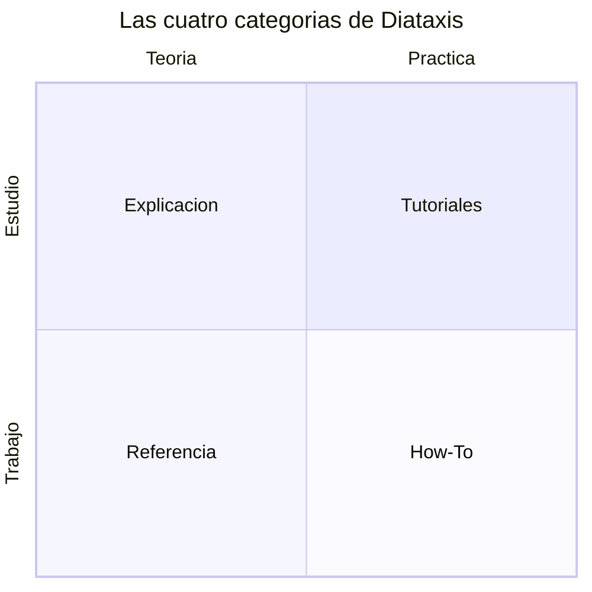
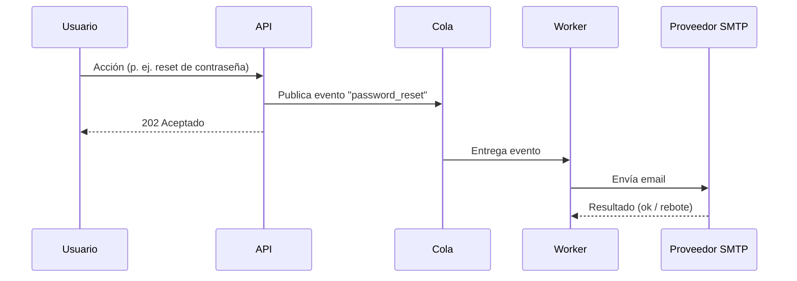
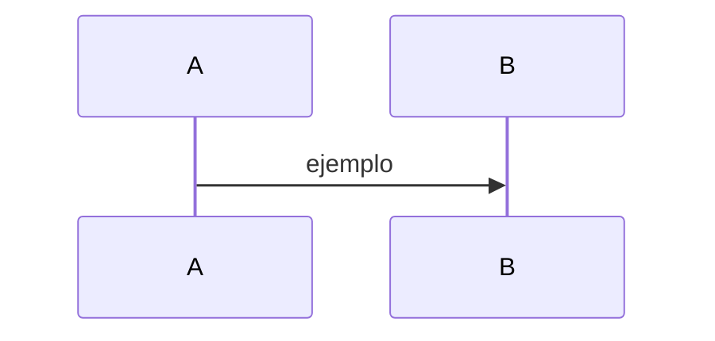

# Prompt maestro — Base de documentación Docs-as-Code + Diátaxis + Obsidian

> **Qué es este archivo.** Es un *prompt maestro* listo para pegar en **Claude Code**. Cuando lo ejecutes en la raíz de un repositorio (vacío o uno existente al que quieras añadir documentación), Claude Code construirá toda la estructura de carpetas, los archivos base, las plantillas, la configuración de Obsidian y una guía para que otros LLM sepan usar el sistema.
>
> **Cómo usarlo.** Abre Claude Code en la carpeta destino y pega **todo lo que está entre las marcas `=== INICIO DEL PROMPT ===` y `=== FIN DEL PROMPT ===`**. El texto de arriba (estas notas) es solo para ti.

---

## Decisiones de diseño (transparencia)

Antes del prompt, estas son las decisiones que tomé respecto al documento de estándares original, para que puedas ajustarlas si quieres:

1. **El Vault de Obsidian se abre en la RAÍZ del repositorio**, no en `/docs`. El documento describe `/docs` como Vault, pero **Obsidian Code Link** solo puede enlazar a archivos *dentro* del Vault. Como el código fuente vive fuera de `/docs` (p. ej. en `/src`), abrir la raíz como Vault permite enlazar documentación ↔ código sin fricción. Toda la documentación sigue viviendo dentro de `/docs`. (Si prefieres `vault = /docs` estricto, el kit explica cómo usar *Code Link: Import project* para crear symlinks del código dentro de `docs/projects/`.)
2. **Dataview es el motor principal** (barras de progreso, RTM, dashboards), tal como prescribe el documento. **Bases** (plugin nativo del núcleo) queda habilitado como complemento para tableros/tablas simples sin dependencias.
3. **Los binarios de los plugins NO se versionan.** Se rastrea únicamente la *lista* de plugins (`community-plugins.json`); cada persona los instala desde Obsidian siguiendo el tutorial incluido. Esto mantiene el repo liviano y fiel al `.gitignore` del documento.
4. **Añadí dos archivos de configuración compartida** al `.gitignore` además de los cuatro del documento: `templates.json` (carpeta de plantillas) y `types.json` (tipos de propiedades, para que el frontmatter se renderice consistente en todo el equipo). Es una extensión natural del mismo principio: "rastrear solo la configuración funcional compartida".
5. **Idioma:** toda la prosa va en **español**; las claves, rutas y valores enumerados van en **inglés** y `lower_snake_case`, como exige el estándar.

---

`=== INICIO DEL PROMPT ===`

# ROL Y MISIÓN

Eres un ingeniero de plataforma experto en *Docs-as-Code*, en el framework **Diátaxis** y en usar **Obsidian** como motor de conocimiento sobre un repositorio Git. Tu tarea es **construir, desde cero y en el directorio actual, una base de documentación reutilizable** que cumpla todo lo descrito abajo.

El resultado debe ser un repositorio que:
- sirva como **plantilla descargable** para iniciar la documentación de cualquier proyecto,
- contenga una **guía explícita para que otros LLM/agentes** entiendan y mantengan el sistema (Diátaxis, esquema de metadatos, enlazado a código, reglas de PR),
- traiga el **Vault de Obsidian preconfigurado** (ajustes + lista de plugins necesarios),
- y **explique cómo funciona Diátaxis** mediante documentos de ejemplo que son, ellos mismos, ejemplos correctos de cada tipo.

Trabaja de forma autónoma: crea todos los archivos con su contenido completo (no dejes marcadores "TODO"), inicializa Git y, al final, entrega un resumen y los siguientes pasos.

---

# CONTEXTO Y PRINCIPIOS (lo que debes asumir como verdad)

**Filosofía.** El código es un *pasivo* (liability), no un activo. La documentación es un mecanismo de diseño para reducir fricción y evitar errores arquitectónicos repetidos. La documentación vive **junto al código**, en el mismo repositorio, se versiona con Git y se revisa en los mismos Pull Requests. Obsidian no es un silo: es un IDE de conocimiento que lee los Markdown locales.

**Regla de oro.** Todo PR que cambie lógica del código debe incluir, en el **mismo** PR, la actualización de la documentación adyacente (ADRs, Specs, guías, referencia). Código y documentación se validan mutuamente en la revisión.

**Diátaxis.** Toda documentación se clasifica en cuatro tipos que **nunca se mezclan** en un mismo documento, según dos ejes (acción↔conocimiento, estudio↔trabajo):

| Tipo | Necesidad | Eje | Estilo | Ejemplo |
|---|---|---|---|---|
| **Tutorial** | Aprender haciendo, guiado | Práctica · Estudio | Directivo, sin opciones, éxito garantizado | "Construye tu primer endpoint" |
| **How-To** | Resolver una tarea concreta | Práctica · Trabajo | Prescriptivo, sin teoría | "Cómo purgar la caché de Redis en producción" |
| **Referencia** | Consultar datos precisos | Teoría · Trabajo | Austero, exhaustivo, estructurado | "Diccionario de la API de Pagos" |
| **Explicación** | Entender el porqué | Teoría · Estudio | Discursivo, analítico | "Por qué elegimos arquitectura orientada a eventos" |

**Tipos especiales.** Además de los cuatro de Diátaxis, el sistema usa: **ADR** (Architecture Decision Record, formato MADR, inmutable y enumerado), **Spec** (Tech Spec previo a codear) y **MOC** (Map of Content: índice dinámico de un dominio con Dataview).

---

# RESULTADO ESPERADO: árbol del repositorio

Construye EXACTAMENTE esta estructura. La **raíz del repositorio es el Vault de Obsidian** (`.obsidian/` va en la raíz). Toda la documentación vive dentro de `docs/`.

```
.
├── .gitignore
├── README.md
├── AGENTS.md                       # Guía para LLMs/agentes (FUENTE DE VERDAD del sistema)
├── CLAUDE.md                       # Puntero a AGENTS.md
├── CONTRIBUTING.md                 # Flujo Docs-as-Code y reglas de PR
├── LICENSE                         # MIT
├── .obsidian/                      # Configuración del Vault (mayormente ignorada por Git)
│   ├── app.json                    # (rastreado)
│   ├── core-plugins.json           # (rastreado)
│   ├── community-plugins.json      # (rastreado) — plugins obligatorios del equipo
│   ├── hotkeys.json                # (rastreado)
│   ├── templates.json              # (rastreado) — carpeta de plantillas
│   └── types.json                  # (rastreado) — tipos de propiedades (esquema)
└── docs/
    ├── 00-MOCs/
    │   ├── MOC - Inicio.md          # Dashboard global con Dataview (progreso, deuda técnica, colas)
    │   └── MOC - Seguridad y Autenticación.md   # MOC de dominio (ejemplo)
    ├── 10-Architecture/
    │   └── ADR-0001-adoptar-docs-as-code-con-obsidian.md   # ADR de ejemplo (auto-referencial)
    ├── 20-Specifications/
    │   └── SPEC-0001-notificaciones-por-email.md           # Tech Spec de ejemplo
    ├── 30-Guides/
    │   ├── tutorial-configurar-el-vault.md                 # Diátaxis: Tutorial
    │   └── how-to-crear-un-documento-nuevo.md              # Diátaxis: How-To
    ├── 40-Reference/
    │   └── reference-esquema-de-metadatos.md               # Diátaxis: Referencia (el esquema YAML)
    ├── 50-Explanations/
    │   └── explanation-que-es-diataxis.md                  # Diátaxis: Explicación (EXPLICA DIÁTAXIS)
    ├── 90-Templates/
    │   ├── _plantilla-tutorial.md
    │   ├── _plantilla-how-to.md
    │   ├── _plantilla-reference.md
    │   ├── _plantilla-explanation.md
    │   ├── _plantilla-adr.md
    │   ├── _plantilla-spec.md
    │   └── _plantilla-moc.md
    └── 99-Assets/
        └── .gitkeep
```

Propósito de cada carpeta (inclúyelo como referencia mental):
- `00-MOCs/` — Mapas de contenido (índices dinámicos por dominio, generados con Dataview).
- `10-Architecture/` — ADRs, decisiones de diseño, diagramas de topología.
- `20-Specifications/` — Tech Specs, RFCs, requisitos en curso.
- `30-Guides/` — Tutoriales y How-To (Diátaxis: práctica). Onboarding y runbooks.
- `40-Reference/` — Contratos de API, esquemas de BD, diccionarios (Diátaxis: teoría/trabajo).
- `50-Explanations/` — Análisis profundos, post-mortems, discusiones de diseño (Diátaxis: teoría/estudio).
- `90-Templates/` — Plantillas maestras (núcleo de la estandarización).
- `99-Assets/` — Diagramas exportados, imágenes y artefactos estáticos.

---

# CONTENIDO EXACTO DE LOS ARCHIVOS

Crea cada archivo con el contenido indicado. Donde veas `{{date:YYYY-MM-DD}}` y `{{title}}` en las **plantillas**, déjalos literales (son tokens del plugin Templates). En los **documentos de ejemplo**, sustituye las fechas por `2026-05-31`.

## A) Configuración de Obsidian (`.obsidian/`)

### `.obsidian/community-plugins.json`
Lista de plugins obligatorios del equipo. (Los binarios no se versionan; cada quien los instala.)
````json
[
  "dataview",
  "obsidian-git",
  "code-link",
  "at-symbol-linking"
]
````

### `.obsidian/core-plugins.json`
Plugins del núcleo habilitados (incluye **Templates**, **Canvas**, **Bases** y **Daily notes** para dev logs). Obsidian normalizará este archivo en el primer arranque; esto es un punto de partida.
````json
{
  "file-explorer": true,
  "global-search": true,
  "switcher": true,
  "graph": true,
  "backlink": true,
  "outgoing-link": true,
  "tag-pane": true,
  "properties": true,
  "page-preview": true,
  "daily-notes": true,
  "templates": true,
  "note-composer": true,
  "command-palette": true,
  "editor-status": true,
  "bookmarks": true,
  "outline": true,
  "word-count": true,
  "file-recovery": true,
  "canvas": true,
  "bases": true
}
````

### `.obsidian/app.json`
Ajustes clave. **`showUnsupportedFiles: true` es crítico**: equivale a "Detectar todas las extensiones de archivo" y permite que Code Link enlace a `.py`, `.ts`, `.go`, `.rs`, etc. `useMarkdownLinks: false` activa los wikilinks `[[...]]` que requieren Code Link y @ Symbol Linking.
````json
{
  "alwaysUpdateLinks": true,
  "useMarkdownLinks": false,
  "newLinkFormat": "shortest",
  "showUnsupportedFiles": true,
  "attachmentFolderPath": "docs/99-Assets",
  "useTab": true,
  "tabSize": 2,
  "showLineNumber": true,
  "strictLineBreaks": false
}
````

### `.obsidian/templates.json`
Configura la carpeta de plantillas del plugin Templates del núcleo.
````json
{
  "folder": "docs/90-Templates",
  "dateFormat": "YYYY-MM-DD",
  "timeFormat": "HH:mm"
}
````

### `.obsidian/types.json`
Tipos de las propiedades del frontmatter, para que se rendericen igual para todo el equipo (fechas como fecha, listas como lista). Obsidian gestiona este archivo; esto es la semilla.
````json
{
  "types": {
    "aliases": "aliases",
    "tags": "tags",
    "diataxis_type": "text",
    "domain": "text",
    "status": "text",
    "owner": "text",
    "related_code": "multitext",
    "created_date": "date",
    "updated_date": "date"
  }
}
````

### `.obsidian/hotkeys.json`
Atajos compartidos (punto de partida). Verifica los IDs de comandos contra las versiones instaladas; los teclados son personales, pero se versiona uno base para crear "memoria muscular" de equipo.
````json
{
  "templates:insert-template": [{ "modifiers": ["Mod", "Shift"], "key": "I" }]
}
````

## B) `.gitignore` (en la raíz)

Rastrea solo la configuración funcional compartida; ignora el estado local/volátil y los binarios de plugins.
````gitignore
# === Obsidian: rastrear SOLO la configuración compartida del equipo ===
.obsidian/*
!.obsidian/app.json
!.obsidian/core-plugins.json
!.obsidian/community-plugins.json
!.obsidian/hotkeys.json
!.obsidian/templates.json
!.obsidian/types.json

# Estado local / volátil (ya excluido por la línea de arriba; explícito para documentar):
#   workspace.json, workspace-mobile.json, appearance.json, graph.json, canvas.json
# Binarios de plugins: se instalan localmente (ver docs/30-Guides/tutorial-configurar-el-vault.md)
#   .obsidian/plugins/

# === Ruido de sistema operativo / editores ===
.DS_Store
Thumbs.db
.trash/
*.swp
.idea/
.vscode/
````

## C) `AGENTS.md` — guía para LLMs/agentes (FUENTE DE VERDAD)

Este es el documento más importante para que otros LLM usen el sistema. Créalo completo:
````markdown
# AGENTS.md — Cómo usar y mantener esta base de conocimiento

> Si eres un agente de IA (Claude, Copilot, Cursor, etc.) o un LLM trabajando en este repositorio, **lee este archivo antes de crear, editar o enlazar documentación**. Define la taxonomía, el esquema de metadatos, el enlazado a código y las reglas de Pull Request.

## 1. Qué es este repositorio

La documentación vive **junto al código**, en el mismo repo Git, y se trata **como código**: texto plano (Markdown), versionada, revisada en PRs. El directorio `docs/` es un **Vault de Obsidian**. El Vault se abre en la **raíz del repositorio** para que Obsidian indexe tanto `docs/` como el código fuente (`src/`, etc.) y se puedan enlazar entre sí.

## 2. Regla de oro (innegociable)

**Todo cambio de lógica en el código se acompaña, en el mismo PR, de la actualización de la documentación correspondiente** (ADR, Spec, guía o referencia). Si un comentario o corrección aparece repetidamente en las revisiones, ese criterio debe documentarse, enseñarse o automatizarse.

## 3. Diátaxis: árbol de decisión para clasificar un documento

Antes de escribir, decide el tipo. Pregúntate **¿el lector quiere APRENDER o TRABAJAR/CONSULTAR?**

- **APRENDER**
  - ¿Paso a paso desde cero, para alguien que aún no sabe nada y necesita una primera victoria? → **Tutorial** · carpeta `docs/30-Guides/` · `diataxis_type: tutorial`
  - ¿Explica el porqué, el contexto, las alternativas, las decisiones? → **Explicación** · `docs/50-Explanations/` · `diataxis_type: explanation`
- **TRABAJAR / CONSULTAR**
  - ¿Pasos para una tarea concreta que el lector ya sabe que necesita hacer? → **How-To** · `docs/30-Guides/` · `diataxis_type: how_to`
  - ¿Datos precisos para consultar (API, esquema, parámetros, eventos)? → **Referencia** · `docs/40-Reference/` · `diataxis_type: reference`
- **CASOS ESPECIALES**
  - ¿Una decisión arquitectónica con consecuencias y alternativas? → **ADR** (formato MADR) · `docs/10-Architecture/` · `diataxis_type: adr`
  - ¿Qué se va a construir y por qué, *antes* de codear? → **Spec** · `docs/20-Specifications/` · `diataxis_type: spec`
  - ¿Un índice/panel de un dominio? → **MOC** · `docs/00-MOCs/` · `diataxis_type: moc`

**Regla que nunca se rompe:** no mezcles tipos en un mismo documento. Una guía de despliegue de emergencia (How-To) no se interrumpe con la filosofía de los contenedores (Explicación). Si necesitas ambos, crea dos documentos y enlázalos.

## 4. Mapa de carpetas

| Carpeta | Contenido |
|---|---|
| `docs/00-MOCs/` | Mapas de contenido (índices dinámicos por dominio, con Dataview) |
| `docs/10-Architecture/` | ADRs, decisiones de diseño, diagramas de topología |
| `docs/20-Specifications/` | Tech Specs, RFCs, requisitos en curso |
| `docs/30-Guides/` | Tutoriales y How-To, onboarding, runbooks |
| `docs/40-Reference/` | Contratos de API, esquemas de BD, diccionarios |
| `docs/50-Explanations/` | Análisis, post-mortems, discusiones de diseño |
| `docs/90-Templates/` | Plantillas maestras |
| `docs/99-Assets/` | Imágenes y diagramas exportados |

## 5. Frontmatter obligatorio (esquema YAML)

**Toda** nota nueva empieza con este bloque. Propiedades en `lower_snake_case`. Detalle completo en [[reference-esquema-de-metadatos]].

```yaml
---
aliases: []                 # nombres/acrónimos alternativos (lista)
tags: []                    # taxonomías menores: [python, refactor, tech-debt]
diataxis_type:              # tutorial | how_to | reference | explanation | adr | spec | moc
domain:                     # backend | frontend | infrastructure | security | database | ui_ux
status: draft               # draft | in_review | active | deprecated | superseded
owner: "[[ ]]"              # enlace interno al responsable: [[Nombre]]
related_code: []            # rutas/símbolos vinculados: ["src/auth/service.py"]
created_date: 2026-01-01    # YYYY-MM-DD (inmutable)
updated_date: 2026-01-01    # YYYY-MM-DD (última revisión sustancial)
---
```

## 6. Cómo crear un documento nuevo

1. Decide el **tipo** (sección 3) y por tanto la **carpeta** y el `diataxis_type`.
2. Crea el archivo en esa carpeta con un nombre descriptivo en `kebab-case` (p. ej. `how-to-rotar-claves-jwt.md`). Para ADRs usa `ADR-NNNN-titulo.md`; para Specs `SPEC-NNNN-titulo.md`.
3. Inserta la plantilla correspondiente de `docs/90-Templates/` (en Obsidian: *Insert template*) y rellena el frontmatter.
4. **Enlázalo a su MOC** de dominio en `docs/00-MOCs/` (o confía en la consulta Dataview del MOC si el frontmatter está bien puesto).
5. Si describe o afecta código, **enlaza al código** (sección 7) y rellena `related_code`.

## 7. Enlazar a código (no pegues bloques de código)

Pegar bloques de código en la doc garantiza que se desincronicen. En su lugar:

- **Code Link** (símbolos): enlaza a un símbolo del código fuente con la sintaxis de barra vertical:
  `[[email_service.py]]|send_email`
  En *vista de lectura*, Obsidian renderiza el fragmento exacto (clase/función) con resaltado, sin duplicar bytes. Requiere `showUnsupportedFiles: true` (ya configurado).
- **@ Symbol Linking** (referencia rápida): al escribir `@` aparece un buscador acotado a directorios/alias para enlazar sin fricción.
- **Enlaces a bloque/línea** (`^`): para una línea concreta que no es un símbolo (p. ej. una línea de un manifiesto de Kubernetes), usa anclas de bloque `^id` y enlázalas.

No crees archivos genéricos sin dueño (`utils.js`, `helpers.py`): rompen el enlazado por bloques y diluyen la responsabilidad del dominio.

## 8. Diagramas como código (Mermaid)

Todo diagrama se escribe en **Mermaid** dentro del Markdown (se renderiza nativo en Obsidian y en GitHub/GitLab). Así, el diff del PR muestra exactamente qué cambió.
- Flujos y procesos con estado (auth, microservicios, ciclos de vida) → `sequenceDiagram`.
- Esquemas de BD y topologías → `erDiagram` (y `architecture-beta` si aplica).
Nunca incrustes imágenes exportadas de Draw.io/Visio para diagramas que cambian con el código.

## 9. Convenciones de nombres y estilo

- Propiedades del frontmatter: `lower_snake_case`. Valores enumerados: en inglés (ver esquema).
- Prosa de la documentación: en **español**.
- Títulos de ADR: frase sustantivada y **enumerada** secuencialmente (`ADR-0042: Adoptar arquitectura orientada a eventos con Kafka`).
- Code-smells / deuda: etiqueta `#tech-debt` para que aparezcan en los dashboards.

## 10. Ciclo de vida (`status`)

`draft` → `in_review` → `active` → (`deprecated` | `superseded`).
**Los ADRs nunca se borran.** Si una decisión se revierte, marca el ADR original como `status: superseded` y enlaza al ADR que lo reemplaza. Se preserva la memoria institucional.

## 11. Checklist antes de abrir un PR

- [ ] ¿El documento tiene un único `diataxis_type` y está en la carpeta correcta?
- [ ] ¿El frontmatter está completo y en `lower_snake_case`?
- [ ] ¿`owner`, `domain` y `status` están puestos?
- [ ] ¿Enlacé al código con Code Link / `@` / bloques en vez de pegar código?
- [ ] ¿Los diagramas están en Mermaid (no imágenes)?
- [ ] ¿El cambio de código y su documentación van en el **mismo** PR?
- [ ] ¿`updated_date` actualizado si fue una revisión sustancial?

## 12. Referencia rápida

| Quiero… | Tipo | Carpeta | `diataxis_type` |
|---|---|---|---|
| Enseñar desde cero | Tutorial | `docs/30-Guides/` | `tutorial` |
| Resolver una tarea | How-To | `docs/30-Guides/` | `how_to` |
| Documentar una API/esquema | Referencia | `docs/40-Reference/` | `reference` |
| Explicar el porqué | Explicación | `docs/50-Explanations/` | `explanation` |
| Registrar una decisión | ADR (MADR) | `docs/10-Architecture/` | `adr` |
| Planear antes de codear | Spec | `docs/20-Specifications/` | `spec` |
| Indexar un dominio | MOC | `docs/00-MOCs/` | `moc` |

Más detalle conceptual: [[explanation-que-es-diataxis]] · sitio oficial: https://diataxis.fr
````

## D) `CLAUDE.md` — puntero

````markdown
# CLAUDE.md

Este repositorio usa el sistema de documentación **Docs-as-Code + Diátaxis + Obsidian**.

➡️ **Antes de crear, editar o enlazar cualquier documento, lee [`AGENTS.md`](./AGENTS.md).** Define la taxonomía Diátaxis, el esquema de frontmatter obligatorio, las plantillas en `docs/90-Templates/`, el enlazado a código (Code Link, `@`, bloques `^`) y las reglas de Pull Request.

**Regla de oro:** todo cambio de lógica en el código se acompaña, en el mismo PR, de la actualización de la documentación correspondiente en `docs/`.
````

## E) `README.md`

````markdown
# Base de documentación — Docs-as-Code · Diátaxis · Obsidian

Plantilla reutilizable para documentar proyectos de software con documentación que **vive junto al código**, se versiona con Git y se navega/edita con **Obsidian**. La organización del contenido sigue el framework **[Diátaxis](https://diataxis.fr)**.

## Por qué

El código es un pasivo, no un activo. La documentación es un mecanismo de diseño que reduce fricción y evita repetir errores arquitectónicos. Por eso vive en el mismo repo, se revisa en los mismos PRs y usa los mismos flujos que el código.

## Estructura

```
docs/
  00-MOCs/          Índices dinámicos por dominio (Dataview)
  10-Architecture/  ADRs y decisiones de diseño
  20-Specifications/ Tech Specs y RFCs
  30-Guides/        Tutoriales y How-To (Diátaxis: práctica)
  40-Reference/     APIs, esquemas, diccionarios (Diátaxis: teoría/trabajo)
  50-Explanations/  Análisis y porqués (Diátaxis: teoría/estudio)
  90-Templates/     Plantillas maestras
  99-Assets/        Imágenes y diagramas
```

## Diátaxis en 20 segundos

| | Aprender | Trabajar |
|---|---|---|
| **Práctica** | Tutorial | How-To |
| **Teoría** | Explicación | Referencia |

Detalle: [`docs/50-Explanations/explanation-que-es-diataxis.md`](docs/50-Explanations/explanation-que-es-diataxis.md).

## Empezar

### Opción A — Iniciar un proyecto nuevo con esta base
1. Clona o descarga este repositorio (o úsalo como *template* de GitHub).
2. Abre **la carpeta raíz** del repo como Vault en Obsidian.
3. Sigue el tutorial: [`docs/30-Guides/tutorial-configurar-el-vault.md`](docs/30-Guides/tutorial-configurar-el-vault.md) (instala los plugins y verifica la configuración).

### Opción B — Añadir documentación a un proyecto existente
Copia al proyecto: la carpeta `docs/`, la carpeta `.obsidian/`, `.gitignore` (fusiona reglas), `AGENTS.md`, `CLAUDE.md` y `CONTRIBUTING.md`. Abre la raíz del proyecto como Vault.

## Plugins necesarios

| Plugin | ID | Para qué |
|---|---|---|
| Dataview | `dataview` | MOCs, dashboards, barras de progreso, matriz de trazabilidad |
| Obsidian Git | `obsidian-git` | Commit/push/pull desde Obsidian |
| Code Link | `code-link` | Enlazar a símbolos del código fuente (TreeSitter) |
| @ Symbol Linking | `at-symbol-linking` | Referencia rápida con `@` |
| Bases (núcleo) | — | Tableros/tablas nativas (complemento) |

## Para agentes / LLMs

Lee **[`AGENTS.md`](./AGENTS.md)**: es la fuente de verdad sobre cómo usar y mantener el sistema.

## Licencia

MIT — ver [`LICENSE`](./LICENSE).
````

## F) `CONTRIBUTING.md`

````markdown
# Cómo contribuir a la documentación

La documentación es **código**. Sigue el mismo rigor que el software.

## Flujo Docs-as-Code

1. Crea una rama desde `main`.
2. Escribe/edita Markdown en `docs/` (usa las plantillas de `docs/90-Templates/`).
3. Si cambias lógica del código, **incluye la documentación en el mismo PR**.
4. Abre un Pull Request. La doc se revisa igual que el código.

## Reglas de revisión (bloqueantes)

- Un documento = un único `diataxis_type`, en la carpeta correcta (ver `AGENTS.md`).
- Frontmatter completo, en `lower_snake_case`, con `owner`, `domain` y `status`.
- Enlaces a código con **Code Link / `@` / bloques `^`**, nunca bloques de código pegados.
- Diagramas en **Mermaid**, no imágenes exportadas.
- ADRs: nunca se borran; si se revierten, `status: superseded` + enlace al reemplazo.
- Deuda técnica: etiqueta `#tech-debt`.

## Estilo

- Prosa en español; claves/rutas/valores enumerados en inglés `lower_snake_case`.
- Documentos cortos, analíticos y focalizados. Evita archivos genéricos sin dueño (`utils.md`, `helpers.md`).

## Commits

Mensajes claros e imperativos. Si el PR cambia código + doc, descríbelo en conjunto, p. ej.:
`feat(notificaciones): envío por email + SPEC-0001 y ADR-0003`.
````

## G) `LICENSE`
Crea una licencia **MIT** estándar, con `Copyright (c) 2026` y un placeholder de titular (`<TITULAR>` que el usuario reemplazará).

## H) Documento de Explicación que EXPLICA DIÁTAXIS

### `docs/50-Explanations/explanation-que-es-diataxis.md`
Este documento es, a la vez, la explicación pedida del método **y** un ejemplo correcto de un documento tipo *Explicación*.
````markdown
---
aliases: [Diátaxis, Las cuatro categorías, Taxonomía de documentación]
tags: [diataxis, meta, documentacion]
diataxis_type: explanation
domain:
status: active
owner: "[[ ]]"
related_code: []
created_date: 2026-05-31
updated_date: 2026-05-31
---

# Qué es Diátaxis y por qué lo usamos

> [!abstract] En una frase
> Diátaxis organiza la documentación técnica en **cuatro tipos que no se mezclan** —tutoriales, guías how-to, referencia y explicación— porque cada uno responde a una necesidad distinta del lector en un momento distinto.

## El problema que resuelve

Existe un error frecuente: la "falacia de la documentación del ingeniero". El autor de un componente intenta transferir todo su modelo mental de golpe, estructurando la información según la topología interna del sistema o el orden en que lo programó, en lugar de según lo que el lector necesita *ahora*. El resultado es un bloque monolítico donde los pasos para resolver un problema urgente quedan enterrados bajo párrafos sobre la historia del diseño de la base de datos.

Diátaxis resuelve esto separando la documentación por **necesidad del lector**, no por estructura del sistema.

## Los dos ejes

Diátaxis cruza dos preguntas:

- **¿Acción o conocimiento?** ¿El lector quiere *hacer* algo o *entender* algo?
- **¿Estudio o trabajo?** ¿Está *aprendiendo* (adquiriendo destreza) o *aplicando* lo que ya sabe en una tarea real?



## Los cuatro cuadrantes

### 1. Tutoriales — *aprender haciendo* (práctica · estudio)
Llevan de la mano a alguien nuevo hasta una primera victoria repetible. Son **directivos**: eliminan opciones y variables, garantizan el éxito. No explican teoría ni alternativas.
*Ejemplo:* "Construye tu primer endpoint en este proyecto".

### 2. Guías How-To — *resolver una tarea concreta* (práctica · trabajo)
Resuelven un problema real que el lector **ya sabe** que tiene. Son **prescriptivas** y van directo a la acción, sin teoría innecesaria.
*Ejemplo:* "Cómo purgar la caché de Redis en producción".

### 3. Referencia — *consultar datos precisos* (teoría · trabajo)
Información descriptiva, factual y exacta sobre la maquinaria del software: como un diccionario o un mapa. **Austera, exhaustiva, muy estructurada.** No enseña ni argumenta.
*Ejemplo:* "Diccionario de la API de Pagos", "Esquema de la BD de usuarios".

### 4. Explicación — *entender el porqué* (teoría · estudio)
Contexto, historia y justificaciones. Aquí viven las discusiones de diseño y los porqués. **Discursiva, analítica, reflexiva.**
*Ejemplo:* "Por qué elegimos una arquitectura orientada a eventos para el motor de notificaciones". *(Este mismo documento es de tipo Explicación.)*

## La regla que nunca se rompe

**No mezclar cuadrantes en un mismo documento.** Una guía de despliegue de emergencia (How-To) no debe interrumpirse con la filosofía de los contenedores (Explicación). Si el lector necesita ambas cosas, son dos documentos enlazados entre sí.

## Cómo se traduce en nuestras carpetas

| Tipo | `diataxis_type` | Carpeta |
|---|---|---|
| Tutorial | `tutorial` | `docs/30-Guides/` |
| How-To | `how_to` | `docs/30-Guides/` |
| Referencia | `reference` | `docs/40-Reference/` |
| Explicación | `explanation` | `docs/50-Explanations/` |

(Los tipos especiales **ADR**, **Spec** y **MOC** viven en `10-Architecture/`, `20-Specifications/` y `00-MOCs/` respectivamente.)

## Cómo decidir dónde va un documento

1. ¿El lector quiere **aprender** o **trabajar/consultar**?
2. Si aprender: ¿necesita una primera victoria guiada (**Tutorial**) o entender el porqué (**Explicación**)?
3. Si trabajar/consultar: ¿necesita lograr una tarea concreta (**How-To**) o consultar datos exactos (**Referencia**)?

En caso de duda, el síntoma de mezcla es escribir "primero un poco de contexto…" dentro de un How-To: ese contexto pertenece a una Explicación aparte.

## Para profundizar

- Sitio oficial: https://diataxis.fr
- Esquema de metadatos: [[reference-esquema-de-metadatos]]
- Plantillas listas para usar: carpeta `docs/90-Templates/`
````

## I) Documento de Referencia: el esquema de metadatos

### `docs/40-Reference/reference-esquema-de-metadatos.md`
Es un ejemplo correcto de documento tipo *Referencia* y la fuente autoritativa del frontmatter.
````markdown
---
aliases: [Esquema YAML, Frontmatter, Propiedades]
tags: [referencia, metadatos, frontmatter]
diataxis_type: reference
domain:
status: active
owner: "[[ ]]"
related_code: [".obsidian/types.json"]
created_date: 2026-05-31
updated_date: 2026-05-31
---

# Referencia: esquema de metadatos (frontmatter YAML)

Toda nota empieza con un bloque de propiedades en `lower_snake_case`. Este esquema permite que los MOCs, dashboards y la matriz de trazabilidad funcionen.

## Propiedades

| Clave | Tipo | Obligatoria | Propósito y reglas |
|---|---|---|---|
| `aliases` | lista | no | Nombres/acrónimos alternativos para enlazar la nota desde otros nombres. |
| `tags` | lista | no | Taxonomías menores: `[python, refactor, tech-debt]`. |
| `diataxis_type` | enum | **sí** | `tutorial` · `how_to` · `reference` · `explanation` · `adr` · `spec` · `moc`. |
| `domain` | enum | **sí** | `backend` · `frontend` · `infrastructure` · `security` · `database` · `ui_ux`. |
| `status` | enum | **sí** | `draft` · `in_review` · `active` · `deprecated` · `superseded`. |
| `owner` | enlace | **sí** | Responsable del mantenimiento: `[[Nombre]]`. |
| `related_code` | lista | no | Rutas/símbolos vinculados: `["src/auth/service.py"]`. |
| `created_date` | fecha | **sí** | `YYYY-MM-DD`. Inmutable (génesis del documento). |
| `updated_date` | fecha | **sí** | `YYYY-MM-DD`. Última revisión sustancial. |

## Bloque para copiar y pegar

```yaml
---
aliases: []
tags: []
diataxis_type:
domain:
status: draft
owner: "[[ ]]"
related_code: []
created_date: 2026-01-01
updated_date: 2026-01-01
---
```

## Valores enumerados (referencia rápida)

- **diataxis_type:** `tutorial`, `how_to`, `reference`, `explanation`, `adr`, `spec`, `moc`
- **domain:** `backend`, `frontend`, `infrastructure`, `security`, `database`, `ui_ux`
- **status:** `draft`, `in_review`, `active`, `deprecated`, `superseded`

## Notas de implementación

- Las claves nunca llevan espacios ni mayúsculas (`lower_snake_case`) para no romper scripts de CI ni consultas.
- Los tipos de cada propiedad se versionan en `.obsidian/types.json` para que se rendericen igual en todo el equipo.
````

## J) ADR de ejemplo (formato MADR, auto-referencial)

### `docs/10-Architecture/ADR-0001-adoptar-docs-as-code-con-obsidian.md`
Es un ejemplo correcto de ADR **y** registra la decisión que da origen a este kit.
````markdown
---
aliases: [ADR-0001]
tags: [adr, documentacion, tooling]
diataxis_type: adr
domain: infrastructure
status: accepted
owner: "[[ ]]"
related_code: [".obsidian/community-plugins.json", ".gitignore"]
created_date: 2026-05-31
updated_date: 2026-05-31
---

# ADR-0001: Adoptar Docs-as-Code con Obsidian y Diátaxis

## Estado
Aceptado.

## Contexto
La documentación alojada en wikis externas (Confluence, Notion) se desincroniza del código: el software evoluciona con cada despliegue, pero las páginas externas quedan estáticas y se vuelven artefactos engañosos. Necesitamos que la documentación se mantenga sincronizada con el código, sea revisable y siga siendo legible y recuperable a largo plazo, independiente de cualquier proveedor SaaS.

Además, la documentación tiende a desordenarse cuando mezcla tipos de contenido (pasos urgentes enterrados bajo teoría histórica), lo que dificulta encontrar información durante incidentes y eleva la fricción del onboarding.

## Decisión
Adoptamos **Docs-as-Code**: la documentación se escribe en Markdown dentro del mismo repositorio (`docs/`), se versiona con Git, se revisa en los mismos Pull Requests y se navega con **Obsidian** abierto en la **raíz del repositorio** (para que Obsidian Code Link indexe y enlace el código fuente). El contenido se organiza con el framework **Diátaxis** y se gobierna con un esquema de frontmatter obligatorio.

## Consecuencias

**Positivas**
- La documentación y el código se validan mutuamente en cada PR.
- Acceso offline, búsqueda local rápida y durabilidad (texto plano).
- Diátaxis reduce la fricción de búsqueda y de onboarding.
- MOCs y dashboards con Dataview dan visibilidad del progreso sin herramientas externas.

**Negativas / costos**
- Cada persona debe instalar y configurar Obsidian y un conjunto de plugins (mitigado con un tutorial y configuración versionada).
- Dependencia de plugins comunitarios (Dataview, Code Link, @ Symbol Linking); se monitorea su mantenimiento y se valora migrar consultas simples a **Bases** (nativo) con el tiempo.
- Disciplina requerida: el frontmatter y la clasificación deben mantenerse correctos.

## Opciones consideradas

- **Wiki externa (Confluence/Notion):** descartada por desincronización con el código y dependencia de proveedor.
- **Markdown en `/docs` sin Obsidian:** válido, pero pierde enlazado bidireccional, MOCs dinámicos, enlace a símbolos de código y dashboards.
- **Vault = `/docs` (en vez de la raíz):** descartado como predeterminado porque Code Link no puede enlazar al código fuente fuera del Vault. Alternativa disponible: importar el código como symlinks con *Code Link: Import project*.

> Si en el futuro se revierte esta decisión, **no se borra este ADR**: se marca `status: superseded` y se enlaza al ADR que lo reemplaza.
````

## K) Tech Spec de ejemplo (con tareas para barra de progreso)

### `docs/20-Specifications/SPEC-0001-notificaciones-por-email.md`
````markdown
---
aliases: [SPEC-0001, Notificaciones email]
tags: [spec, notificaciones]
diataxis_type: spec
domain: backend
status: in_review
owner: "[[ ]]"
related_code: ["src/notifications/email_service.py"]
created_date: 2026-05-31
updated_date: 2026-05-31
---

# SPEC-0001: Notificaciones por email

## Problema
Los usuarios no reciben aviso cuando ocurren eventos relevantes en su cuenta (registro, restablecimiento de contraseña, alertas de seguridad), lo que genera tickets de soporte y desconfianza.

## Metas
- Enviar emails transaccionales para 3 eventos: alta de cuenta, reset de contraseña y alerta de inicio de sesión sospechoso.
- Latencia de encolado < 200 ms en el camino síncrono (el envío es asíncrono).
- Entregabilidad observable (tasa de rebote medible).

## No-Metas (fuera de alcance)
- Emails de marketing o campañas.
- Editor visual de plantillas.
- Notificaciones push o SMS (futuras integraciones).

## Requisitos y restricciones
- El envío no debe bloquear la petición del usuario (cola + worker).
- Cumplir con la baja de suscripción donde aplique.
- No registrar contenido sensible en logs.

## Arquitectura y diseño
El servicio publica un evento y un worker lo consume y envía vía proveedor SMTP.



Lógica de envío: [[email_service.py]]|send_email
Decisión relacionada: ver futuros ADRs sobre elección de proveedor SMTP.

## Tareas
- [x] Definir contrato del evento
- [x] Implementar publicación en API
- [ ] Implementar worker de consumo
- [ ] Integrar proveedor SMTP
- [ ] Plantillas de los 3 emails
- [ ] Métricas de entregabilidad
- [ ] Pruebas de integración

## Preguntas abiertas
- ¿Qué proveedor SMTP usamos (coste vs. entregabilidad)?
- ¿Reintentos: cuántos y con qué backoff?
````

## L) Tutorial de ejemplo (configurar el Vault)

### `docs/30-Guides/tutorial-configurar-el-vault.md`
````markdown
---
aliases: [Configurar Obsidian, Setup del vault]
tags: [tutorial, onboarding, obsidian]
diataxis_type: tutorial
domain: infrastructure
status: active
owner: "[[ ]]"
related_code: [".obsidian/community-plugins.json"]
created_date: 2026-05-31
updated_date: 2026-05-31
---

# Tutorial: configurar el Vault de Obsidian para este repositorio

Al terminar, tendrás Obsidian abierto sobre este repo, con todos los plugins funcionando y la documentación enlazada al código. Sigue los pasos en orden.

## 1. Instala Obsidian
Descarga Obsidian desde https://obsidian.md e instálalo.

## 2. Abre el repositorio como Vault
En Obsidian: *Open folder as vault* → selecciona la **carpeta raíz de este repositorio** (la que contiene `docs/` y `.obsidian/`). Confía en el Vault si te lo pregunta.

## 3. Activa "Detectar todas las extensiones de archivo"
Ve a *Settings → Files and Links* y activa **Detect all file extensions** (ya viene preconfigurado, pero verifícalo). Esto permite enlazar a `.py`, `.ts`, `.go`, etc.

## 4. Instala los plugins obligatorios
*Settings → Community plugins → Browse* e instala (luego *Enable*):
- **Dataview**
- **Obsidian Git**
- **Code Link**
- **@ Symbol Linking** (busca "@ symbol linking")

Si un plugin no aparece en la lista de instalados tras habilitarlo, cierra y reabre Obsidian.

## 5. Verifica el plugin de plantillas
*Settings → Core plugins* → asegúrate de que **Templates** está activo y de que su carpeta apunta a `docs/90-Templates`.

## 6. Comprueba que todo funciona
1. Abre `docs/50-Explanations/explanation-que-es-diataxis.md`: el diagrama Mermaid debe renderizar.
2. Abre `docs/00-MOCs/MOC - Inicio.md` en **vista de lectura**: las tablas de Dataview deben mostrar datos.
3. Abre `docs/20-Specifications/SPEC-0001-notificaciones-por-email.md` en vista de lectura: el enlace `[[email_service.py]]|send_email` mostrará el fragmento de código (cuando exista `src/notifications/email_service.py`).

## ¡Listo!
Ya puedes crear documentación. Continúa con [[how-to-crear-un-documento-nuevo]].
````

## M) How-To de ejemplo (crear un documento)

### `docs/30-Guides/how-to-crear-un-documento-nuevo.md`
````markdown
---
aliases: [Crear documento, Nuevo doc]
tags: [how-to, documentacion]
diataxis_type: how_to
domain:
status: active
owner: "[[ ]]"
related_code: []
created_date: 2026-05-31
updated_date: 2026-05-31
---

# Cómo crear un documento nuevo

Pasos para añadir un documento bien clasificado y enlazado.

1. **Elige el tipo** con el árbol de decisión de [[explanation-que-es-diataxis]] o de `AGENTS.md`.
2. **Crea el archivo** en la carpeta correspondiente, con nombre en `kebab-case`:
   - Tutorial/How-To → `docs/30-Guides/` (p. ej. `how-to-rotar-claves-jwt.md`)
   - Referencia → `docs/40-Reference/`
   - Explicación → `docs/50-Explanations/`
   - ADR → `docs/10-Architecture/ADR-NNNN-titulo.md`
   - Spec → `docs/20-Specifications/SPEC-NNNN-titulo.md`
   - MOC → `docs/00-MOCs/`
3. **Inserta la plantilla**: paleta de comandos → *Templates: Insert template* → elige la plantilla de `docs/90-Templates/` que corresponda. (Atajo por defecto: `Ctrl/Cmd+Shift+I`.)
4. **Rellena el frontmatter** según [[reference-esquema-de-metadatos]] (`diataxis_type`, `domain`, `status`, `owner`).
5. **Enlaza al código** si aplica: `[[archivo.py]]|simbolo`, `@` o anclas de bloque `^`. Rellena `related_code`.
6. **Conéctalo al MOC** de su dominio en `docs/00-MOCs/` (o confía en la consulta Dataview si el frontmatter está correcto).
7. **Abre el PR** junto con el cambio de código asociado (regla de oro).
````

## N) MOC de inicio (dashboard global con Dataview)

### `docs/00-MOCs/MOC - Inicio.md`
````markdown
---
aliases: [Inicio, Home, Panel]
tags: [moc, dashboard]
diataxis_type: moc
domain:
status: active
owner: "[[ ]]"
related_code: []
created_date: 2026-05-31
updated_date: 2026-05-31
---

# 🏠 MOC de Inicio

Panel global de la base de conocimiento. Ábrelo en **vista de lectura** para que Dataview renderice.

## Documentos por tipo
```dataview
TABLE WITHOUT ID file.link AS "Documento", diataxis_type AS "Tipo", domain AS "Dominio", status AS "Estado", updated_date AS "Actualizado"
FROM "docs"
WHERE diataxis_type
SORT updated_date DESC
```

## En revisión (cola)
```dataview
TABLE WITHOUT ID file.link AS "Documento", diataxis_type AS "Tipo", owner AS "Responsable"
FROM "docs"
WHERE status = "in_review"
SORT updated_date ASC
```

## Deuda técnica
```dataview
TABLE WITHOUT ID file.link AS "Nota", domain AS "Dominio", status AS "Estado"
FROM #tech-debt
SORT file.mtime DESC
```

## Progreso de las Specs
```dataviewjs
const specs = dv.pages('"docs/20-Specifications"').where(p => p.diataxis_type === "spec");
if (!specs.length) { dv.paragraph("No hay specs todavía."); }
for (const page of specs) {
  const tasks = page.file.tasks;
  const total = tasks.length;
  const done = tasks.where(t => t.completed).length;
  const pct = total ? Math.round((100 * done) / total) : 0;
  dv.el(
    "div",
    `<strong>${page.file.link}</strong> — ${pct}% (${done}/${total})
     <progress value="${done}" max="${total || 1}" style="width:100%"></progress>`
  );
}
```

## Mapas de contenido por dominio
```dataview
LIST
FROM "docs/00-MOCs"
WHERE diataxis_type = "moc" AND file.name != this.file.name
SORT file.name ASC
```
````

## O) MOC de dominio (ejemplo)

### `docs/00-MOCs/MOC - Seguridad y Autenticación.md`
````markdown
---
aliases: [MOC Seguridad, Auth MOC]
tags: [moc, security]
diataxis_type: moc
domain: security
status: active
owner: "[[ ]]"
related_code: []
created_date: 2026-05-31
updated_date: 2026-05-31
---

# 🔐 MOC — Seguridad y Autenticación

Puerto de entrada al dominio de seguridad. Centraliza decisiones, especificaciones, guías y referencia.

## Todo lo del dominio (automático)
```dataview
TABLE WITHOUT ID file.link AS "Documento", diataxis_type AS "Tipo", status AS "Estado", updated_date AS "Actualizado"
FROM "docs"
WHERE domain = "security" AND file.name != this.file.name
SORT diataxis_type ASC, updated_date DESC
```

## Enlaces destacados (manuales)
- Decisiones: ver ADRs con `domain: security` arriba.
- Specs en curso: ver tabla.
- Guía de onboarding de seguridad: *(añadir cuando exista)*.
````

## P) Plantillas (`docs/90-Templates/`)

Crea las 7 plantillas. Mantén los tokens `{{title}}` y `{{date:YYYY-MM-DD}}` literales.

### `docs/90-Templates/_plantilla-tutorial.md`
````markdown
---
aliases: []
tags: [tutorial]
diataxis_type: tutorial
domain:
status: draft
owner: "[[ ]]"
related_code: []
created_date: {{date:YYYY-MM-DD}}
updated_date: {{date:YYYY-MM-DD}}
---

# Tutorial: {{title}}

Al terminar, sabrás <objetivo concreto y alcanzable>. Sigue los pasos en orden; no necesitas conocimientos previos.

## Antes de empezar
- Requisito 1
- Requisito 2

## 1. Primer paso
…

## 2. Segundo paso
…

## ¡Listo!
Lograste <resultado>. A continuación puedes ver [[<how-to relacionado>]].
````

### `docs/90-Templates/_plantilla-how-to.md`
````markdown
---
aliases: []
tags: [how-to]
diataxis_type: how_to
domain:
status: draft
owner: "[[ ]]"
related_code: []
created_date: {{date:YYYY-MM-DD}}
updated_date: {{date:YYYY-MM-DD}}
---

# Cómo {{title}}

Pasos para <tarea concreta>. (Sin teoría: si necesitas el porqué, enlaza a una Explicación.)

1. Paso 1
2. Paso 2
3. Paso 3

## Verificación
Cómo confirmar que funcionó.
````

### `docs/90-Templates/_plantilla-reference.md`
````markdown
---
aliases: []
tags: [referencia]
diataxis_type: reference
domain:
status: draft
owner: "[[ ]]"
related_code: []
created_date: {{date:YYYY-MM-DD}}
updated_date: {{date:YYYY-MM-DD}}
---

# Referencia: {{title}}

Descripción factual y exhaustiva. Sin tutoriales ni argumentación.

## <Elemento> 
| Campo | Tipo | Descripción |
|---|---|---|
|  |  |  |

## Notas
- …
````

### `docs/90-Templates/_plantilla-explanation.md`
````markdown
---
aliases: []
tags: [explicacion]
diataxis_type: explanation
domain:
status: draft
owner: "[[ ]]"
related_code: []
created_date: {{date:YYYY-MM-DD}}
updated_date: {{date:YYYY-MM-DD}}
---

# {{title}}

> [!abstract] En una frase
> <resumen>

## Contexto
…

## Discusión / análisis
…

## Conclusión
…

## Enlaces
- …
````

### `docs/90-Templates/_plantilla-adr.md`
````markdown
---
aliases: []
tags: [adr]
diataxis_type: adr
domain:
status: draft
owner: "[[ ]]"
related_code: []
created_date: {{date:YYYY-MM-DD}}
updated_date: {{date:YYYY-MM-DD}}
---

# ADR-NNNN: {{title}}

## Estado
Propuesto. <!-- Propuesto | En revisión | Aceptado | Superseded -->

## Contexto
Hechos neutrales: fuerzas en conflicto, restricciones, naturaleza del problema. Sin sesgos.

## Decisión
<Un párrafo en voz activa estableciendo el camino elegido.>

## Consecuencias
**Positivas**
- …

**Negativas / costos**
- …

## Opciones consideradas
- **Opción A:** … (rechazada porque …)
- **Opción B:** … (rechazada porque …)

<!-- Si se revierte: no borrar. Cambiar status a superseded y enlazar al ADR que lo reemplaza. -->
````

### `docs/90-Templates/_plantilla-spec.md`
````markdown
---
aliases: []
tags: [spec]
diataxis_type: spec
domain:
status: draft
owner: "[[ ]]"
related_code: []
created_date: {{date:YYYY-MM-DD}}
updated_date: {{date:YYYY-MM-DD}}
---

# SPEC-NNNN: {{title}}

## Problema
Contexto de negocio y dolor del usuario.

## Metas
Criterios de éxito medibles.

## No-Metas (fuera de alcance)
Fronteras explícitas (defensa contra el scope creep).

## Requisitos y restricciones
Reglas de negocio, límites de rendimiento, seguridad.

## Arquitectura y diseño
Propuesta técnica. Enlaza a diagramas (Mermaid), ADRs y código.



## Tareas
- [ ] …
- [ ] …

## Preguntas abiertas
- …
````

### `docs/90-Templates/_plantilla-moc.md`
````markdown
---
aliases: []
tags: [moc]
diataxis_type: moc
domain:
status: active
owner: "[[ ]]"
related_code: []
created_date: {{date:YYYY-MM-DD}}
updated_date: {{date:YYYY-MM-DD}}
---

# MOC — {{title}}

Puerto de entrada al dominio. Centraliza enlaces a decisiones, specs, guías y referencia.

## Todo lo del dominio (automático)
```dataview
TABLE WITHOUT ID file.link AS "Documento", diataxis_type AS "Tipo", status AS "Estado", updated_date AS "Actualizado"
FROM "docs"
WHERE domain = this.domain AND file.name != this.file.name
SORT diataxis_type ASC, updated_date DESC
```

## Enlaces destacados (manuales)
- …
````

## Q) `docs/99-Assets/.gitkeep`
Crea un archivo vacío `docs/99-Assets/.gitkeep` para que la carpeta exista en Git.

---

# INICIALIZACIÓN DE GIT

1. Si no hay repositorio, ejecuta `git init` y crea la rama `main`.
2. Añade todo y haz el commit inicial:
   - mensaje: `chore: base de documentación Docs-as-Code + Diátaxis + Obsidian`
3. **No** añadas un remoto ni hagas push (lo hará el usuario). Si ya existe un remoto, no lo modifiques.
4. Verifica con `git status` que los archivos `.obsidian/*.json` whitelisted están rastreados y que `.obsidian/workspace.json`, `appearance.json` y `plugins/` quedan ignorados (no deberían aparecer salvo que existan localmente).

---

# LISTA DE VERIFICACIÓN FINAL (autocomprobación antes de terminar)

- [ ] La estructura de carpetas coincide exactamente con el árbol especificado.
- [ ] Existen los 6 archivos en `.obsidian/` y `community-plugins.json` contiene los 4 IDs correctos (`dataview`, `obsidian-git`, `code-link`, `at-symbol-linking`).
- [ ] `app.json` tiene `showUnsupportedFiles: true` y `useMarkdownLinks: false`.
- [ ] `.gitignore` rastrea solo los 6 JSON whitelisted e ignora `plugins/` y el estado volátil.
- [ ] `AGENTS.md` está completo (árbol de decisión Diátaxis, esquema YAML, enlazado a código, reglas de PR) y `CLAUDE.md` apunta a él.
- [ ] Hay **un documento de ejemplo por cada cuadrante** Diátaxis, más un ADR, un Spec y dos MOCs, y **todos tienen frontmatter válido**.
- [ ] `explanation-que-es-diataxis.md` explica los 4 tipos y los 2 ejes, e incluye un diagrama Mermaid válido.
- [ ] Las 7 plantillas existen y conservan los tokens `{{title}}` / `{{date:YYYY-MM-DD}}`.
- [ ] Las consultas Dataview/DataviewJS del MOC de Inicio están bien formadas (apuntan a `"docs"` / `"docs/20-Specifications"`).
- [ ] Toda la prosa está en español; claves/rutas/enums en inglés `lower_snake_case`.
- [ ] `git init` + commit inicial hechos; sin remoto añadido.

---

# AL TERMINAR, ENTREGA AL USUARIO

Imprime un resumen con:
1. El **árbol final** generado (`tree` o equivalente).
2. La lista de **plugins a instalar** en Obsidian (Dataview, Obsidian Git, Code Link, @ Symbol Linking) y el recordatorio de abrir **la raíz del repo** como Vault.
3. Los **siguientes pasos**: abrir el Vault, instalar plugins siguiendo `docs/30-Guides/tutorial-configurar-el-vault.md`, reemplazar `<TITULAR>` en `LICENSE`, y crear el remoto + `git push`.
4. Una nota de que `docs/50-Explanations/explanation-que-es-diataxis.md` y `AGENTS.md` son los puntos de partida para entender el sistema.

`=== FIN DEL PROMPT ===`
