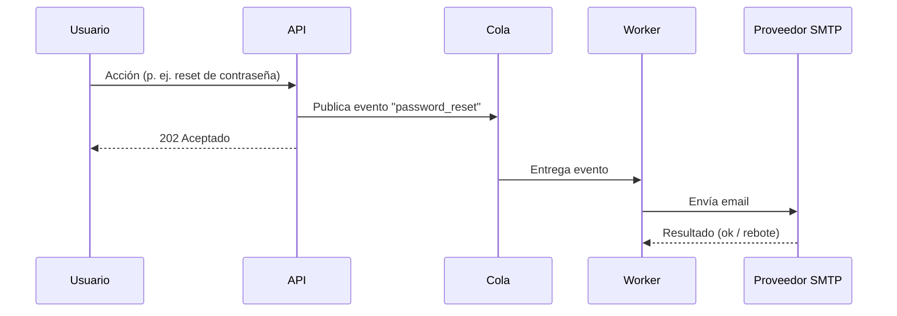

# SPEC-0001: Notificaciones por email

## Problema
Los usuarios no reciben aviso cuando ocurren eventos relevantes en su cuenta (registro, restablecimiento de contraseña, alertas de seguridad), lo que genera tickets de soporte y desconfianza.

## Metas
- Enviar emails transaccionales para 3 eventos: alta de cuenta, reset de contraseña y alerta de inicio de sesión sospechoso.
- Latencia de encolado < 200 ms en el camino síncrono (el envío es asíncrono).
- Entregabilidad observable (tasa de rebote medible).

## No-Metas (fuera de alcance)
- Emails de marketing o campañas.
- Editor visual de plantillas.
- Notificaciones push o SMS (futuras integraciones).

## Requisitos y restricciones
- El envío no debe bloquear la petición del usuario (cola + worker).
- Cumplir con la baja de suscripción donde aplique.
- No registrar contenido sensible en logs.

## Arquitectura y diseño
El servicio publica un evento y un worker lo consume y envía vía proveedor SMTP.

Lógica de envío: [[email_service.py]]|send_email
Decisión relacionada: ver futuros ADRs sobre elección de proveedor SMTP.

## Tareas
- [x] Definir contrato del evento
- [x] Implementar publicación en API
- [ ] Implementar worker de consumo
- [ ] Integrar proveedor SMTP
- [ ] Plantillas de los 3 emails
- [ ] Métricas de entregabilidad
- [ ] Pruebas de integración

## Preguntas abiertas
- ¿Qué proveedor SMTP usamos (coste vs. entregabilidad)?
- ¿Reintentos: cuántos y con qué backoff?
