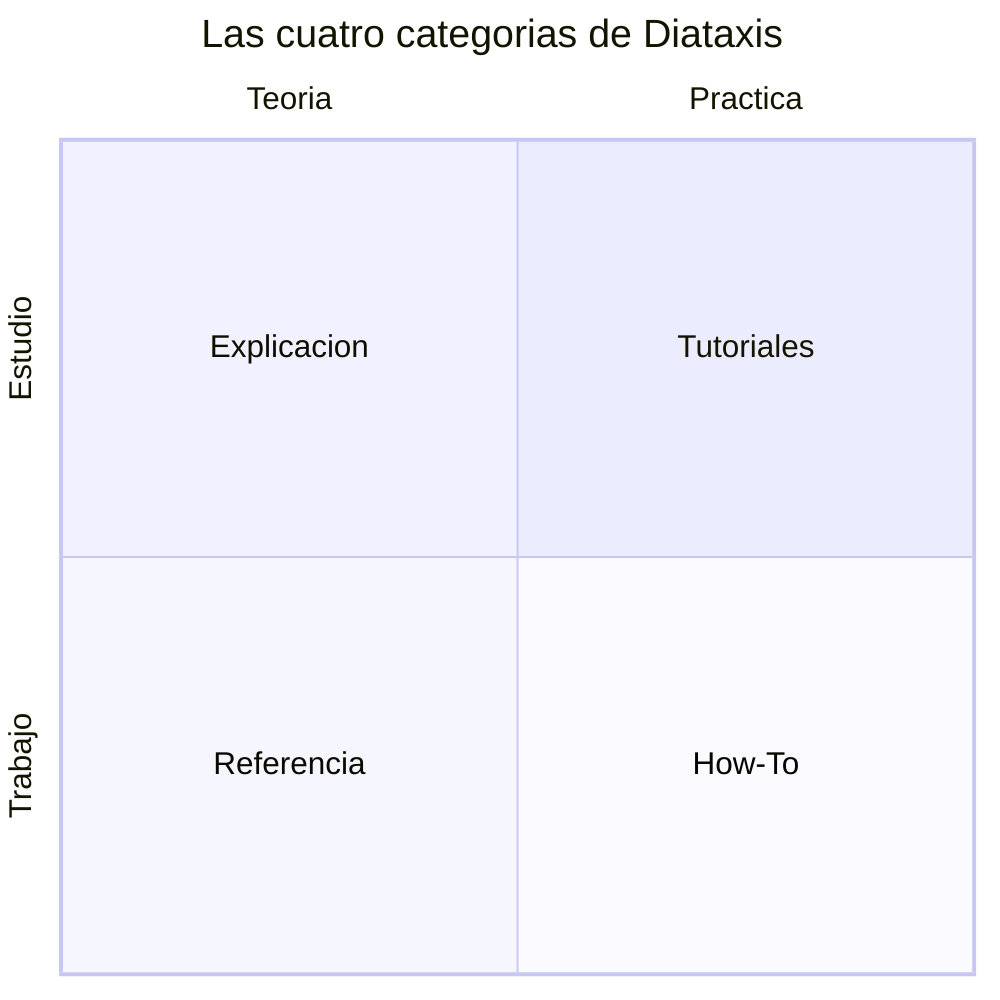

# Qué es Diátaxis y por qué lo usamos

> [!abstract] En una frase
> Diátaxis organiza la documentación técnica en **cuatro tipos que no se mezclan** —tutoriales, guías how-to, referencia y explicación— porque cada uno responde a una necesidad distinta del lector en un momento distinto.

## El problema que resuelve

Existe un error frecuente: la "falacia de la documentación del ingeniero". El autor de un componente intenta transferir todo su modelo mental de golpe, estructurando la información según la topología interna del sistema o el orden en que lo programó, en lugar de según lo que el lector necesita *ahora*. El resultado es un bloque monolítico donde los pasos para resolver un problema urgente quedan enterrados bajo párrafos sobre la historia del diseño de la base de datos.

Diátaxis resuelve esto separando la documentación por **necesidad del lector**, no por estructura del sistema.

## Los dos ejes

Diátaxis cruza dos preguntas:

- **¿Acción o conocimiento?** ¿El lector quiere *hacer* algo o *entender* algo?
- **¿Estudio o trabajo?** ¿Está *aprendiendo* (adquiriendo destreza) o *aplicando* lo que ya sabe en una tarea real?

## Los cuatro cuadrantes

### 1. Tutoriales — *aprender haciendo* (práctica · estudio)
Llevan de la mano a alguien nuevo hasta una primera victoria repetible. Son **directivos**: eliminan opciones y variables, garantizan el éxito. No explican teoría ni alternativas.
*Ejemplo:* "Construye tu primer endpoint en este proyecto".

### 2. Guías How-To — *resolver una tarea concreta* (práctica · trabajo)
Resuelven un problema real que el lector **ya sabe** que tiene. Son **prescriptivas** y van directo a la acción, sin teoría innecesaria.
*Ejemplo:* "Cómo purgar la caché de Redis en producción".

### 3. Referencia — *consultar datos precisos* (teoría · trabajo)
Información descriptiva, factual y exacta sobre la maquinaria del software: como un diccionario o un mapa. **Austera, exhaustiva, muy estructurada.** No enseña ni argumenta.
*Ejemplo:* "Diccionario de la API de Pagos", "Esquema de la BD de usuarios".

### 4. Explicación — *entender el porqué* (teoría · estudio)
Contexto, historia y justificaciones. Aquí viven las discusiones de diseño y los porqués. **Discursiva, analítica, reflexiva.**
*Ejemplo:* "Por qué elegimos una arquitectura orientada a eventos para el motor de notificaciones". *(Este mismo documento es de tipo Explicación.)*

## La regla que nunca se rompe

**No mezclar cuadrantes en un mismo documento.** Una guía de despliegue de emergencia (How-To) no debe interrumpirse con la filosofía de los contenedores (Explicación). Si el lector necesita ambas cosas, son dos documentos enlazados entre sí.

## Cómo se traduce en nuestras carpetas

| Tipo | `diataxis_type` | Carpeta |
|---|---|---|
| Tutorial | `tutorial` | `docs/30-Guides/` |
| How-To | `how_to` | `docs/30-Guides/` |
| Referencia | `reference` | `docs/40-Reference/` |
| Explicación | `explanation` | `docs/50-Explanations/` |

(Los tipos especiales **ADR**, **Spec** y **MOC** viven en `10-Architecture/`, `20-Specifications/` y `00-MOCs/` respectivamente.)

## Cómo decidir dónde va un documento

1. ¿El lector quiere **aprender** o **trabajar/consultar**?
2. Si aprender: ¿necesita una primera victoria guiada (**Tutorial**) o entender el porqué (**Explicación**)?
3. Si trabajar/consultar: ¿necesita lograr una tarea concreta (**How-To**) o consultar datos exactos (**Referencia**)?

En caso de duda, el síntoma de mezcla es escribir "primero un poco de contexto…" dentro de un How-To: ese contexto pertenece a una Explicación aparte.

## Para profundizar

- Sitio oficial: https://diataxis.fr
- Esquema de metadatos: [[reference-esquema-de-metadatos]]
- Plantillas listas para usar: carpeta `docs/90-Templates/`
