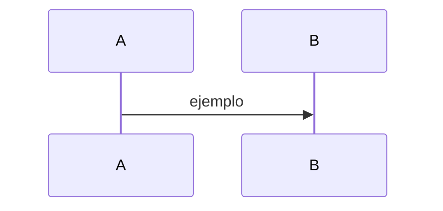

# SPEC-NNNN: {{title}}

## Problema
Contexto de negocio y dolor del usuario.

## Metas
Criterios de éxito medibles.

## No-Metas (fuera de alcance)
Fronteras explícitas (defensa contra el scope creep).

## Requisitos y restricciones
Reglas de negocio, límites de rendimiento, seguridad.

## Arquitectura y diseño
Propuesta técnica. Enlaza a diagramas (Mermaid), ADRs y código.

## Tareas
- [ ] …
- [ ] …

## Preguntas abiertas
- …
